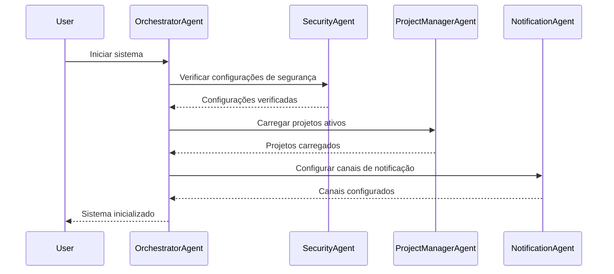
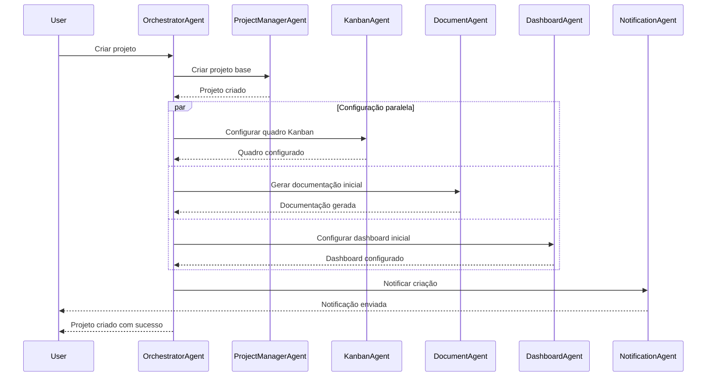
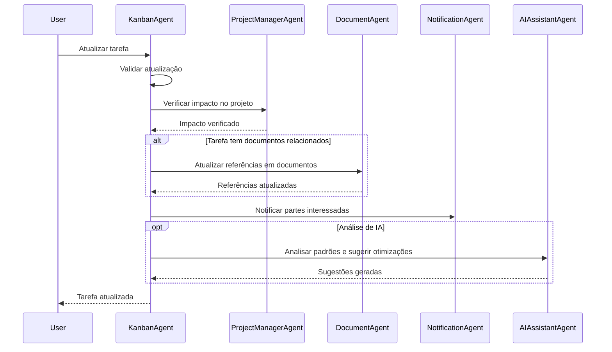
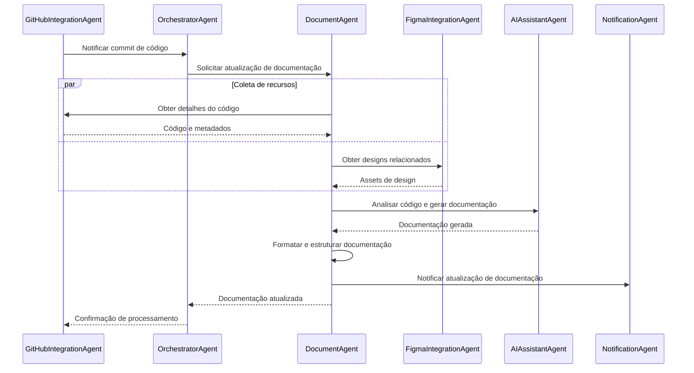
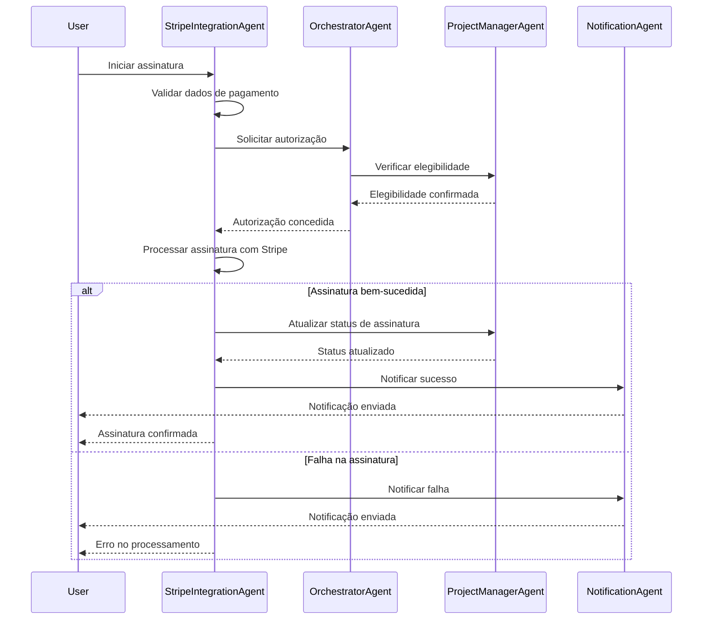
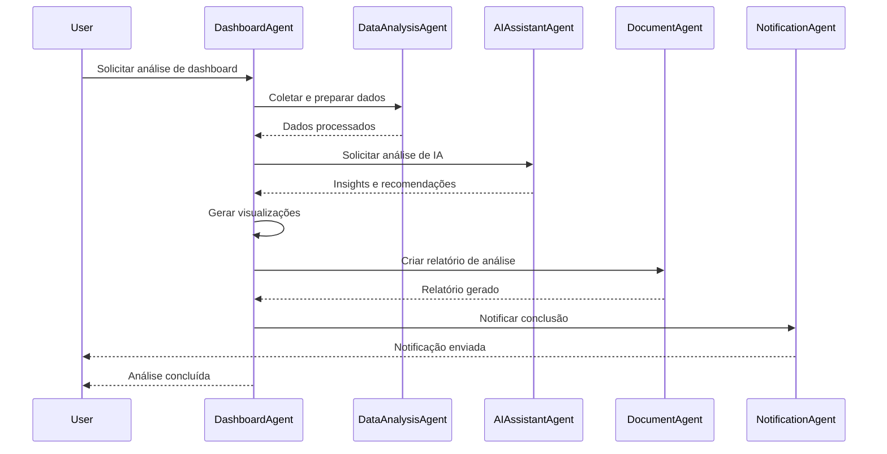
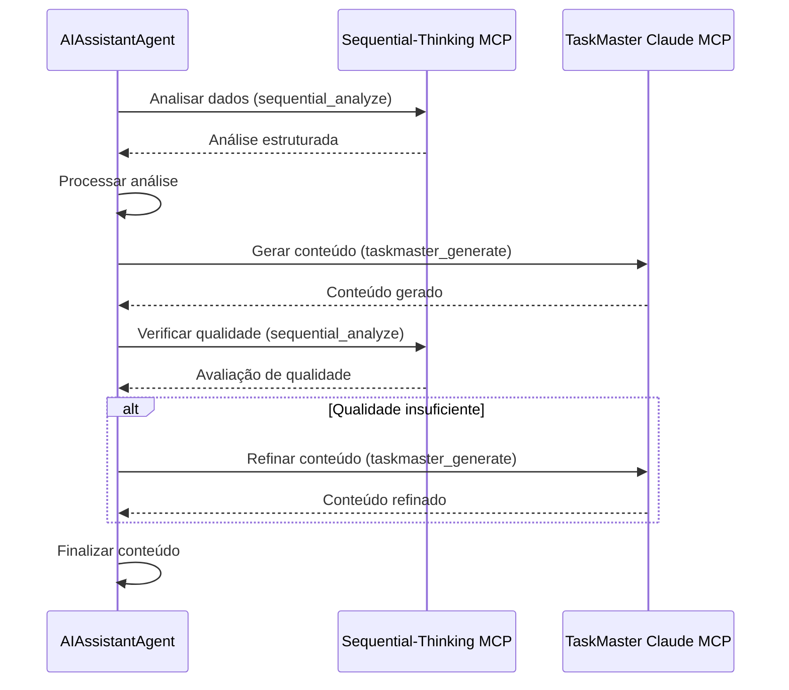
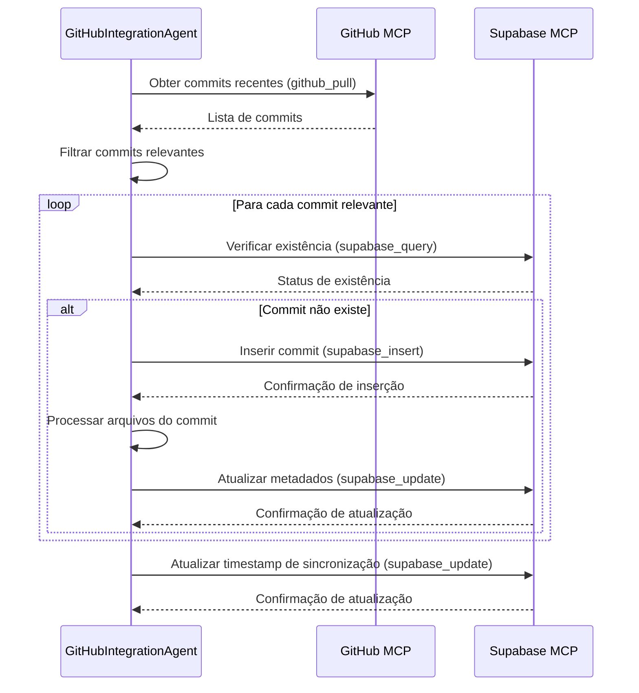
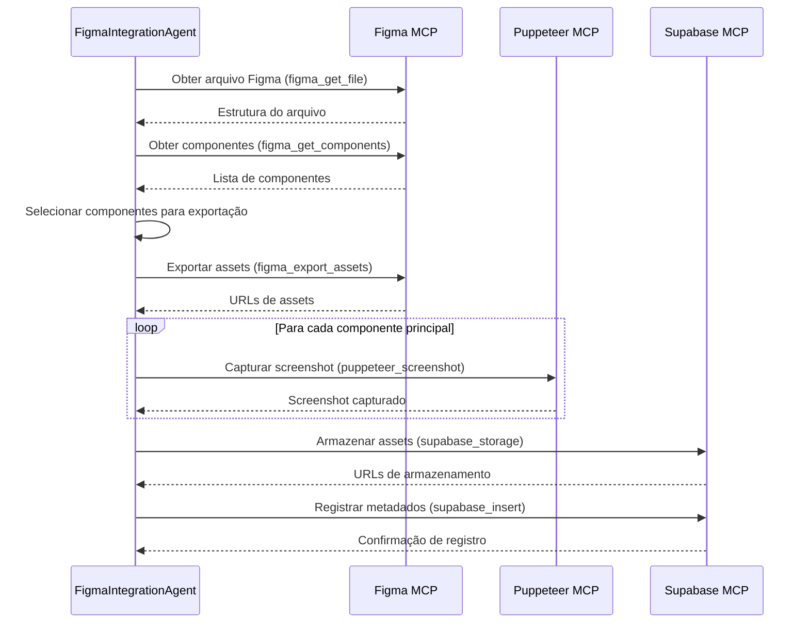

# Fluxo Técnico de Tarefas e Automações entre Agentes

Este documento detalha o fluxo técnico de tarefas e automações entre os agentes do sistema para o SaaS de gerenciamento de projetos no Windsurf AI. O fluxo inclui sequências de operações, gatilhos, condições, tratamento de erros e mecanismos de feedback.

## Visão Geral da Arquitetura de Fluxo

A arquitetura de fluxo segue um modelo de orquestração centralizada com execução distribuída:

1. **Orquestração Central**: O OrchestratorAgent coordena fluxos complexos
2. **Comunicação Direta**: Agentes podem se comunicar diretamente para operações simples
3. **Eventos Assíncronos**: Sistema de eventos para notificações e atualizações
4. **Transações Distribuídas**: Garantia de consistência em operações multi-agente

### Princípios de Design do Fluxo

1. **Idempotência**: Operações podem ser repetidas sem efeitos colaterais
2. **Resiliência**: Recuperação automática de falhas temporárias
3. **Observabilidade**: Rastreamento completo de fluxos de ponta a ponta
4. **Desacoplamento**: Agentes podem evoluir independentemente
5. **Escalabilidade**: Fluxos podem escalar horizontalmente

## Fluxos Principais

### 1. Fluxo de Inicialização do Sistema

Este fluxo é executado durante a inicialização do sistema para configurar o ambiente e preparar os agentes.



**Detalhamento Técnico**:

1. **Verificação de Configurações de Segurança**:
   ```javascript
   // OrchestratorAgent para SecurityAgent
   const securityConfig = await SecurityAgent.verifySecurityConfig({
     environment: process.env.NODE_ENV,
     timestamp: new Date().toISOString()
   });
   
   if (!securityConfig.valid) {
     throw new Error(`Configuração de segurança inválida: ${securityConfig.reason}`);
   }
   ```

2. **Carregamento de Projetos Ativos**:
   ```javascript
   // OrchestratorAgent para ProjectManagerAgent
   const activeProjects = await ProjectManagerAgent.loadActiveProjects({
     limit: 100,
     includeMetrics: true
   });
   
   // Registrar projetos no contexto do orquestrador
   this.context.activeProjects = activeProjects.map(project => ({
     id: project.id,
     name: project.name,
     status: project.status,
     lastActivity: project.lastActivity
   }));
   ```

3. **Configuração de Canais de Notificação**:
   ```javascript
   // OrchestratorAgent para NotificationAgent
   const notificationChannels = await NotificationAgent.configureChannels({
     channels: ['in_app', 'email', 'push'],
     defaultPriorities: {
       'in_app': 'all',
       'email': 'medium_high',
       'push': 'high_only'
     }
   });
   
   this.context.notificationChannels = notificationChannels;
   ```

**Tratamento de Erros**:
- Se a verificação de segurança falhar, o sistema entra em modo de manutenção
- Se o carregamento de projetos falhar, o sistema tenta novamente com um subconjunto menor
- Se a configuração de notificações falhar, o sistema continua apenas com notificações in-app

### 2. Fluxo de Criação de Projeto

Este fluxo gerencia a criação de um novo projeto, incluindo configuração de quadro Kanban, documentação inicial e dashboard.



**Detalhamento Técnico**:

1. **Criação de Projeto Base**:
   ```javascript
   // OrchestratorAgent para ProjectManagerAgent
   const project = await ProjectManagerAgent.createProject({
     name: projectData.name,
     description: projectData.description,
     ownerId: userId,
     template: projectData.template || 'default',
     metadata: {
       priority: projectData.priority || 'medium',
       tags: projectData.tags || [],
       estimatedEndDate: projectData.estimatedEndDate
     }
   });
   
   // Verificar criação bem-sucedida
   if (!project || !project.id) {
     throw new Error('Falha ao criar projeto base');
   }
   
   // Registrar ID do projeto para uso nas próximas etapas
   const projectId = project.id;
   ```

2. **Configuração Paralela**:
   ```javascript
   // OrchestratorAgent inicia tarefas paralelas
   const [kanbanResult, documentResult, dashboardResult] = await Promise.all([
     // Configurar quadro Kanban
     KanbanAgent.createBoard({
       projectId: projectId,
       name: `${projectData.name} Kanban`,
       columns: projectData.columns || ['Backlog', 'To Do', 'In Progress', 'Review', 'Done'],
       wipLimits: projectData.wipLimits || {}
     }),
     
     // Gerar documentação inicial
     DocumentAgent.generateProjectDocumentation({
       projectId: projectId,
       template: 'project_overview',
       data: {
         name: projectData.name,
         description: projectData.description,
         objectives: projectData.objectives,
         stakeholders: projectData.stakeholders,
         timeline: projectData.timeline
       }
     }),
     
     // Configurar dashboard inicial
     DashboardAgent.createDashboard({
       projectId: projectId,
       name: `${projectData.name} Overview`,
       widgets: [
         { type: 'task_status', title: 'Task Status' },
         { type: 'recent_activity', title: 'Recent Activity' },
         { type: 'upcoming_deadlines', title: 'Upcoming Deadlines' }
       ]
     })
   ]);
   
   // Verificar resultados
   const results = {
     kanban: kanbanResult && kanbanResult.id ? { success: true, id: kanbanResult.id } : { success: false },
     documentation: documentResult && documentResult.id ? { success: true, id: documentResult.id } : { success: false },
     dashboard: dashboardResult && dashboardResult.id ? { success: true, id: dashboardResult.id } : { success: false }
   };
   
   // Se alguma configuração falhou, registrar mas continuar
   const failedComponents = Object.entries(results)
     .filter(([_, result]) => !result.success)
     .map(([component, _]) => component);
   
   if (failedComponents.length > 0) {
     console.warn(`Componentes com falha na criação: ${failedComponents.join(', ')}`);
   }
   ```

3. **Notificação de Criação**:
   ```javascript
   // OrchestratorAgent para NotificationAgent
   await NotificationAgent.sendNotification({
     userId: userId,
     title: 'Projeto criado com sucesso',
     message: `O projeto "${projectData.name}" foi criado com sucesso.`,
     type: 'success',
     data: {
       projectId: projectId,
       kanbanBoardId: results.kanban.success ? results.kanban.id : null,
       documentationId: results.documentation.success ? results.documentation.id : null,
       dashboardId: results.dashboard.success ? results.dashboard.id : null
     },
     action: {
       type: 'link',
       target: `/projects/${projectId}`,
       label: 'Ver projeto'
     }
   });
   ```

**Tratamento de Erros**:
- Se a criação do projeto base falhar, todo o fluxo é abortado
- Se componentes secundários falharem, o fluxo continua e registra os componentes com falha
- Retry automático para componentes críticos (até 3 tentativas)
- Notificação ao usuário sobre componentes que não puderam ser criados

### 3. Fluxo de Atualização de Tarefa Kanban

Este fluxo gerencia a atualização de uma tarefa no quadro Kanban, incluindo notificações e atualizações de documentação relacionada.



**Detalhamento Técnico**:

1. **Validação de Atualização**:
   ```javascript
   // KanbanAgent validação interna
   async function validateTaskUpdate(taskId, updateData) {
     // Obter tarefa atual
     const currentTask = await supabaseMCP.invoke('supabase_query', {
       table: 'tasks',
       filter: { id: taskId }
     });
     
     if (!currentTask || currentTask.length === 0) {
       throw new Error(`Tarefa não encontrada: ${taskId}`);
     }
     
     // Verificar permissões
     const hasPermission = await SecurityAgent.checkPermission({
       userId: updateData.userId,
       resourceType: 'task',
       resourceId: taskId,
       action: 'update'
     });
     
     if (!hasPermission.allowed) {
       throw new Error(`Permissão negada: ${hasPermission.reason}`);
     }
     
     // Validar regras de negócio
     if (updateData.status && currentTask[0].status !== updateData.status) {
       // Verificar se a transição de status é permitida
       const allowedTransitions = getTaskStatusTransitions(currentTask[0].status);
       if (!allowedTransitions.includes(updateData.status)) {
         throw new Error(`Transição de status inválida: ${currentTask[0].status} -> ${updateData.status}`);
       }
       
       // Verificar limites WIP se movendo para uma coluna com limite
       if (updateData.column_id) {
         const columnWipLimit = await getColumnWipLimit(updateData.column_id);
         if (columnWipLimit) {
           const currentColumnTasks = await getTasksInColumn(updateData.column_id);
           if (currentColumnTasks.length >= columnWipLimit) {
             throw new Error(`Limite WIP excedido para a coluna (${columnWipLimit})`);
           }
         }
       }
     }
     
     return {
       valid: true,
       currentTask: currentTask[0],
       statusChanged: updateData.status && currentTask[0].status !== updateData.status,
       assigneeChanged: updateData.assignee_id && currentTask[0].assignee_id !== updateData.assignee_id
     };
   }
   ```

2. **Verificação de Impacto no Projeto**:
   ```javascript
   // KanbanAgent para ProjectManagerAgent
   const projectImpact = await ProjectManagerAgent.assessTaskUpdateImpact({
     projectId: task.project_id,
     taskId: task.id,
     currentStatus: validationResult.currentTask.status,
     newStatus: updateData.status || validationResult.currentTask.status,
     currentDueDate: validationResult.currentTask.due_date,
     newDueDate: updateData.due_date || validationResult.currentTask.due_date,
     currentPriority: validationResult.currentTask.priority,
     newPriority: updateData.priority || validationResult.currentTask.priority
   });
   
   // Registrar impacto para notificações
   const impactLevel = projectImpact.impactLevel; // 'none', 'low', 'medium', 'high'
   const affectedMilestones = projectImpact.affectedMilestones || [];
   ```

3. **Atualização de Referências em Documentos**:
   ```javascript
   // KanbanAgent para DocumentAgent (condicional)
   if (validationResult.statusChanged || updateData.title || updateData.description) {
     // Verificar documentos relacionados
     const relatedDocuments = await supabaseMCP.invoke('supabase_query', {
       table: 'document_task_relations',
       filter: { task_id: task.id }
     });
     
     if (relatedDocuments && relatedDocuments.length > 0) {
       // Atualizar referências em documentos
       await DocumentAgent.updateTaskReferences({
         taskId: task.id,
         documents: relatedDocuments.map(rel => rel.document_id),
         updates: {
           title: updateData.title,
           description: updateData.description,
           status: updateData.status,
           priority: updateData.priority,
           dueDate: updateData.due_date
         }
       });
     }
   }
   ```

4. **Notificação de Partes Interessadas**:
   ```javascript
   // KanbanAgent para NotificationAgent
   const stakeholders = [];
   
   // Sempre notificar o criador da tarefa
   if (validationResult.currentTask.created_by) {
     stakeholders.push(validationResult.currentTask.created_by);
   }
   
   // Notificar assignee anterior se mudou
   if (validationResult.assigneeChanged && validationResult.currentTask.assignee_id) {
     stakeholders.push(validationResult.currentTask.assignee_id);
   }
   
   // Notificar novo assignee
   if (updateData.assignee_id) {
     stakeholders.push(updateData.assignee_id);
   }
   
   // Notificar observadores da tarefa
   const taskWatchers = await getTaskWatchers(task.id);
   stakeholders.push(...taskWatchers);
   
   // Remover duplicatas
   const uniqueStakeholders = [...new Set(stakeholders)];
   
   // Enviar notificações
   await Promise.all(uniqueStakeholders.map(userId => 
     NotificationAgent.sendNotification({
       userId: userId,
       title: 'Tarefa atualizada',
       message: `A tarefa "${updateData.title || validationResult.currentTask.title}" foi atualizada.`,
       type: 'info',
       priority: impactLevel === 'high' ? 'high' : 'medium',
       data: {
         taskId: task.id,
         projectId: task.project_id,
         changes: getChangeSummary(validationResult.currentTask, updateData)
       },
       action: {
         type: 'link',
         target: `/projects/${task.project_id}/tasks/${task.id}`,
         label: 'Ver tarefa'
       }
     })
   ));
   ```

5. **Análise de IA (Opcional)**:
   ```javascript
   // KanbanAgent para AIAssistantAgent (opcional)
   if (validationResult.statusChanged && updateData.status === 'done') {
     // Analisar padrões de conclusão de tarefas
     const aiAnalysis = await AIAssistantAgent.analyzeTaskCompletion({
       taskId: task.id,
       projectId: task.project_id,
       completionData: {
         startDate: validationResult.currentTask.created_at,
         endDate: new Date().toISOString(),
         originalEstimate: validationResult.currentTask.metadata?.estimate,
         actualTime: updateData.metadata?.actual || validationResult.currentTask.metadata?.actual
       }
     });
     
     // Se houver sugestões relevantes, armazená-las
     if (aiAnalysis.suggestions && aiAnalysis.suggestions.length > 0) {
       await supabaseMCP.invoke('supabase_insert', {
         table: 'task_insights',
         data: {
           task_id: task.id,
           project_id: task.project_id,
           insights: aiAnalysis.insights,
           suggestions: aiAnalysis.suggestions,
           created_at: new Date().toISOString()
         }
       });
       
       // Notificar gerente do projeto sobre insights
       const projectManagers = await getProjectManagers(task.project_id);
       if (projectManagers && projectManagers.length > 0) {
         await NotificationAgent.sendNotification({
           userId: projectManagers[0],
           title: 'Novos insights de tarefas disponíveis',
           message: `A IA analisou a conclusão da tarefa "${updateData.title || validationResult.currentTask.title}" e gerou insights.`,
           type: 'info',
           data: {
             taskId: task.id,
             projectId: task.project_id,
             insightCount: aiAnalysis.insights.length,
             suggestionCount: aiAnalysis.suggestions.length
           },
           action: {
             type: 'link',
             target: `/projects/${task.project_id}/insights`,
             label: 'Ver insights'
           }
         });
       }
     }
   }
   ```

**Tratamento de Erros**:
- Validação completa antes de qualquer modificação
- Transação para garantir atomicidade das atualizações
- Fallback para componentes não críticos (notificações, análise de IA)
- Registro detalhado de erros para diagnóstico

### 4. Fluxo de Geração de Documentação Automática

Este fluxo gerencia a geração automática de documentação a partir de código-fonte e outros artefatos do projeto.



**Detalhamento Técnico**:

1. **Notificação de Commit de Código**:
   ```javascript
   // GitHubIntegrationAgent para OrchestratorAgent
   async function notifyCodeCommit(repositoryId, commitData) {
     // Verificar se o commit afeta arquivos de código
     const codeFiles = commitData.files.filter(file => isCodeFile(file.filename));
     
     if (codeFiles.length === 0) {
       return { success: true, message: 'Nenhum arquivo de código afetado' };
     }
     
     // Enviar notificação para o orquestrador
     const result = await OrchestratorAgent.handleEvent({
       type: 'code_commit',
       source: 'github',
       data: {
         repositoryId: repositoryId,
         commitId: commitData.sha,
         branch: commitData.branch,
         author: commitData.author,
         message: commitData.message,
         timestamp: commitData.timestamp,
         codeFiles: codeFiles.map(file => ({
           path: file.filename,
           status: file.status,
           additions: file.additions,
           deletions: file.deletions,
           changes: file.changes,
           patch: file.patch
         }))
       }
     });
     
     return result;
   }
   ```

2. **Solicitação de Atualização de Documentação**:
   ```javascript
   // OrchestratorAgent para DocumentAgent
   async function requestDocumentationUpdate(eventData) {
     // Obter projeto associado ao repositório
     const project = await supabaseMCP.invoke('supabase_query', {
       table: 'projects',
       filter: { repository_id: eventData.data.repositoryId }
     });
     
     if (!project || project.length === 0) {
       throw new Error(`Projeto não encontrado para o repositório: ${eventData.data.repositoryId}`);
     }
     
     // Verificar configurações de documentação automática do projeto
     const projectConfig = await getProjectConfig(project[0].id);
     
     if (!projectConfig.autoDocumentation.enabled) {
       return { success: true, message: 'Documentação automática desativada para este projeto' };
     }
     
     // Solicitar atualização de documentação
     const result = await DocumentAgent.updateCodeDocumentation({
       projectId: project[0].id,
       repositoryId: eventData.data.repositoryId,
       commitData: {
         id: eventData.data.commitId,
         message: eventData.data.message,
         author: eventData.data.author,
         timestamp: eventData.data.timestamp
       },
       codeFiles: eventData.data.codeFiles,
       config: projectConfig.autoDocumentation
     });
     
     return result;
   }
   ```

3. **Coleta de Recursos em Paralelo**:
   ```javascript
   // DocumentAgent coleta recursos em paralelo
   async function collectDocumentationResources(projectId, repositoryId, commitData, codeFiles) {
     // Iniciar coleta paralela de recursos
     const [codeDetails, designAssets] = await Promise.all([
       // Obter detalhes do código do GitHub
       GitHubIntegrationAgent.getCodeDetails({
         repositoryId: repositoryId,
         commitId: commitData.id,
         files: codeFiles.map(file => file.path)
       }),
       
       // Obter assets de design relacionados do Figma
       (async () => {
         try {
           // Verificar se há arquivos Figma associados ao projeto
           const figmaFiles = await supabaseMCP.invoke('supabase_query', {
             table: 'project_figma_files',
             filter: { project_id: projectId }
           });
           
           if (!figmaFiles || figmaFiles.length === 0) {
             return { success: true, assets: [] };
           }
           
           // Obter assets de design para os arquivos Figma
           return await FigmaIntegrationAgent.getDesignAssets({
             projectId: projectId,
             figmaFiles: figmaFiles.map(file => file.figma_file_id),
             filter: {
               updatedSince: new Date(Date.now() - 7 * 24 * 60 * 60 * 1000).toISOString() // 7 dias
             }
           });
         } catch (error) {
           console.error('Erro ao obter assets de design:', error);
           return { success: false, error: error.message, assets: [] };
         }
       })()
     ]);
     
     return {
       code: codeDetails,
       design: designAssets
     };
   }
   ```

4. **Análise de Código e Geração de Documentação**:
   ```javascript
   // DocumentAgent para AIAssistantAgent
   async function generateDocumentation(resources, config) {
     // Preparar contexto para análise
     const analysisContext = {
       codeFiles: resources.code.files,
       designAssets: resources.design.assets,
       commitHistory: resources.code.commitHistory,
       existingDocumentation: resources.existingDocs,
       documentationConfig: config
     };
     
     // Solicitar análise e geração de documentação
     const documentationResult = await AIAssistantAgent.analyzeAndGenerateDocumentation({
       context: analysisContext,
       options: {
         format: config.format || 'markdown',
         sections: config.sections || ['overview', 'architecture', 'api', 'examples'],
         detailLevel: config.detailLevel || 'standard',
         includeDesignReferences: resources.design.assets.length > 0,
         includeCodeExamples: true,
         generateDiagrams: config.generateDiagrams || false
       }
     });
     
     return documentationResult;
   }
   ```

5. **Formatação e Estruturação da Documentação**:
   ```javascript
   // DocumentAgent processamento interno
   async function formatAndStructureDocumentation(projectId, documentationResult) {
     // Verificar documentação existente
     const existingDocs = await supabaseMCP.invoke('supabase_query', {
       table: 'document_metadata',
       filter: {
         project_id: projectId,
         type: 'code_documentation',
         status: 'active'
       }
     });
     
     let documentId;
     let isUpdate = false;
     
     if (existingDocs && existingDocs.length > 0) {
       // Atualizar documentação existente
       documentId = existingDocs[0].id;
       isUpdate = true;
       
       // Incrementar versão
       const newVersion = existingDocs[0].version + 1;
       
       // Armazenar nova versão do conteúdo
       await supabaseMCP.invoke('supabase_insert', {
         table: 'document_content',
         data: {
           document_id: documentId,
           version: newVersion,
           content: documentationResult.content,
           content_format: documentationResult.format,
           created_at: new Date().toISOString(),
           created_by: 'system'
         }
       });
       
       // Atualizar metadados do documento
       await supabaseMCP.invoke('supabase_update', {
         table: 'document_metadata',
         filter: { id: documentId },
         data: {
           version: newVersion,
           updated_at: new Date().toISOString(),
           last_modified_by: 'system',
           metadata: {
             ...existingDocs[0].metadata,
             last_commit_id: documentationResult.metadata.commitId,
             sections: documentationResult.metadata.sections,
             generated_diagrams: documentationResult.metadata.diagrams
           }
         }
       });
     } else {
       // Criar nova documentação
       const docMetadata = await supabaseMCP.invoke('supabase_insert', {
         table: 'document_metadata',
         data: {
           project_id: projectId,
           title: 'Documentação Técnica',
           description: 'Documentação técnica gerada automaticamente a partir do código-fonte',
           type: 'code_documentation',
           tags: ['auto-generated', 'code', 'technical'],
           status: 'active',
           version: 1,
           author_id: 'system',
           last_modified_by: 'system',
           created_at: new Date().toISOString(),
           updated_at: new Date().toISOString(),
           metadata: {
             last_commit_id: documentationResult.metadata.commitId,
             sections: documentationResult.metadata.sections,
             generated_diagrams: documentationResult.metadata.diagrams
           }
         }
       });
       
       documentId = docMetadata.id;
       
       // Armazenar conteúdo inicial
       await supabaseMCP.invoke('supabase_insert', {
         table: 'document_content',
         data: {
           document_id: documentId,
           version: 1,
           content: documentationResult.content,
           content_format: documentationResult.format,
           created_at: new Date().toISOString(),
           created_by: 'system'
         }
       });
     }
     
     // Gerar PDF se configurado
     if (documentationResult.format === 'markdown') {
       try {
         const htmlContent = await markdownToHTML(documentationResult.content);
         
         const pdfBuffer = await puppeteerMCP.invoke('puppeteer_pdf', {
           content: htmlContent,
           options: {
             format: 'A4',
             margin: {
               top: '1cm',
               right: '1cm',
               bottom: '1cm',
               left: '1cm'
             },
             printBackground: true,
             displayHeaderFooter: true,
             headerTemplate: '<div style="font-size: 10px; text-align: center; width: 100%;">Documentação Técnica</div>',
             footerTemplate: '<div style="font-size: 8px; text-align: center; width: 100%;">Página <span class="pageNumber"></span> de <span class="totalPages"></span></div>'
           }
         });
         
         // Armazenar PDF
         const pdfPath = `${projectId}/documents/${documentId}.pdf`;
         const storedPdf = await supabaseMCP.invoke('supabase_storage', {
           bucket: 'exports',
           path: pdfPath,
           content: pdfBuffer,
           contentType: 'application/pdf'
         });
         
         // Atualizar metadados com referência ao PDF
         await supabaseMCP.invoke('supabase_update', {
           table: 'document_metadata',
           filter: { id: documentId },
           data: {
             metadata: {
               ...existingDocs[0].metadata,
               pdf_export_path: pdfPath,
               pdf_export_url: storedPdf.url,
               pdf_export_date: new Date().toISOString()
             }
           }
         });
       } catch (error) {
         console.error('Erro ao gerar PDF:', error);
         // Continuar mesmo se a geração de PDF falhar
       }
     }
     
     return {
       documentId: documentId,
       isUpdate: isUpdate,
       version: isUpdate ? existingDocs[0].version + 1 : 1
     };
   }
   ```

6. **Notificação de Atualização de Documentação**:
   ```javascript
   // DocumentAgent para NotificationAgent
   async function notifyDocumentationUpdate(projectId, documentId, isUpdate, commitData) {
     // Obter stakeholders do projeto
     const projectStakeholders = await getProjectStakeholders(projectId);
     
     // Filtrar stakeholders com interesse em documentação
     const interestedStakeholders = projectStakeholders.filter(
       stakeholder => stakeholder.notification_preferences.documentation
     );
     
     if (interestedStakeholders.length === 0) {
       return { success: true, message: 'Nenhum stakeholder interessado em notificações de documentação' };
     }
     
     // Enviar notificações
     await Promise.all(interestedStakeholders.map(stakeholder => 
       NotificationAgent.sendNotification({
         userId: stakeholder.user_id,
         title: isUpdate ? 'Documentação técnica atualizada' : 'Nova documentação técnica disponível',
         message: `A documentação técnica foi ${isUpdate ? 'atualizada' : 'gerada'} com base no commit "${commitData.message.substring(0, 50)}${commitData.message.length > 50 ? '...' : ''}"`,
         type: 'info',
         data: {
           documentId: documentId,
           projectId: projectId,
           commitId: commitData.id,
           isUpdate: isUpdate
         },
         action: {
           type: 'link',
           target: `/projects/${projectId}/documents/${documentId}`,
           label: 'Ver documentação'
         }
       })
     ));
     
     return { success: true, notifiedUsers: interestedStakeholders.length };
   }
   ```

**Tratamento de Erros**:
- Verificação de configuração antes de iniciar o processo
- Coleta de recursos com tratamento de falhas parciais
- Fallback para documentação parcial se alguns recursos não estiverem disponíveis
- Registro de erros específicos para cada etapa do processo

### 5. Fluxo de Integração de Pagamento

Este fluxo gerencia a integração de pagamentos com Stripe, incluindo processamento de assinaturas e atualizações de status.



**Detalhamento Técnico**:

1. **Validação de Dados de Pagamento**:
   ```javascript
   // StripeIntegrationAgent validação interna
   async function validatePaymentData(customerId, planId, paymentMethodId) {
     // Verificar cliente
     const customer = await supabaseMCP.invoke('supabase_query', {
       table: 'customers',
       filter: { id: customerId }
     });
     
     if (!customer || customer.length === 0) {
       throw new Error(`Cliente não encontrado: ${customerId}`);
     }
     
     // Verificar plano
     const plan = await supabaseMCP.invoke('supabase_query', {
       table: 'subscription_plans',
       filter: { id: planId }
     });
     
     if (!plan || plan.length === 0) {
       throw new Error(`Plano não encontrado: ${planId}`);
     }
     
     // Verificar método de pagamento
     try {
       const paymentMethod = await stripeMCP.invoke('stripe_payment', {
         action: 'retrieve_payment_method',
         paymentMethodId: paymentMethodId
       });
       
       if (!paymentMethod || !paymentMethod.id) {
         throw new Error(`Método de pagamento inválido: ${paymentMethodId}`);
       }
     } catch (error) {
       throw new Error(`Erro ao verificar método de pagamento: ${error.message}`);
     }
     
     return {
       valid: true,
       customer: customer[0],
       plan: plan[0]
     };
   }
   ```

2. **Solicitação de Autorização**:
   ```javascript
   // StripeIntegrationAgent para OrchestratorAgent
   async function requestSubscriptionAuthorization(customerId, planId, validationResult) {
     // Solicitar autorização do orquestrador
     const authorizationResult = await OrchestratorAgent.authorizeSubscription({
       customerId: customerId,
       planId: planId,
       customerData: {
         name: validationResult.customer.name,
         email: validationResult.customer.email,
         stripeCustomerId: validationResult.customer.stripe_customer_id
       },
       planData: {
         name: validationResult.plan.name,
         price: validationResult.plan.price,
         currency: validationResult.plan.currency,
         interval: validationResult.plan.interval,
         stripeProductId: validationResult.plan.stripe_product_id,
         stripePriceId: validationResult.plan.stripe_price_id
       }
     });
     
     if (!authorizationResult.authorized) {
       throw new Error(`Autorização negada: ${authorizationResult.reason}`);
     }
     
     return authorizationResult;
   }
   ```

3. **Verificação de Elegibilidade**:
   ```javascript
   // OrchestratorAgent para ProjectManagerAgent
   async function checkSubscriptionEligibility(customerId, planId, customerData, planData) {
     // Verificar projetos do cliente
     const customerProjects = await ProjectManagerAgent.getCustomerProjects({
       customerId: customerId
     });
     
     // Verificar elegibilidade com base no plano
     const eligibilityResult = await ProjectManagerAgent.checkPlanEligibility({
       customerId: customerId,
       planId: planId,
       currentProjects: customerProjects.length,
       planLimits: planData.limits || {}
     });
     
     if (!eligibilityResult.eligible) {
       return {
         authorized: false,
         reason: eligibilityResult.reason,
         details: eligibilityResult.details
       };
     }
     
     return {
       authorized: true,
       projectCount: customerProjects.length,
       eligibilityDetails: eligibilityResult.details
     };
   }
   ```

4. **Processamento de Assinatura com Stripe**:
   ```javascript
   // StripeIntegrationAgent processamento interno
   async function processStripeSubscription(customerId, planId, paymentMethodId, authorizationResult) {
     try {
       // Obter cliente Stripe
       const customer = await supabaseMCP.invoke('supabase_query', {
         table: 'customers',
         filter: { id: customerId }
       });
       
       // Anexar método de pagamento ao cliente
       await stripeMCP.invoke('stripe_payment', {
         action: 'attach_payment_method',
         customerId: customer[0].stripe_customer_id,
         paymentMethodId: paymentMethodId
       });
       
       // Definir método de pagamento como padrão
       await stripeMCP.invoke('stripe_customer', {
         action: 'update',
         customerId: customer[0].stripe_customer_id,
         data: {
           invoice_settings: {
             default_payment_method: paymentMethodId
           }
         }
       });
       
       // Obter plano
       const plan = await supabaseMCP.invoke('supabase_query', {
         table: 'subscription_plans',
         filter: { id: planId }
       });
       
       // Criar assinatura
       const subscription = await stripeMCP.invoke('stripe_subscription', {
         action: 'create',
         customerId: customer[0].stripe_customer_id,
         items: [
           {
             price: plan[0].stripe_price_id
           }
         ],
         expand: ['latest_invoice.payment_intent']
       });
       
       return {
         success: true,
         subscriptionId: subscription.id,
         status: subscription.status,
         currentPeriodEnd: new Date(subscription.current_period_end * 1000).toISOString(),
         invoiceUrl: subscription.latest_invoice.hosted_invoice_url
       };
     } catch (error) {
       console.error('Erro ao processar assinatura Stripe:', error);
       
       return {
         success: false,
         error: error.message
       };
     }
   }
   ```

5. **Atualização de Status de Assinatura**:
   ```javascript
   // StripeIntegrationAgent para ProjectManagerAgent
   async function updateSubscriptionStatus(customerId, planId, stripeResult) {
     if (!stripeResult.success) {
       return {
         success: false,
         error: stripeResult.error
       };
     }
     
     // Registrar assinatura no sistema
     await supabaseMCP.invoke('supabase_insert', {
       table: 'subscriptions',
       data: {
         customer_id: customerId,
         plan_id: planId,
         stripe_subscription_id: stripeResult.subscriptionId,
         status: stripeResult.status,
         current_period_start: new Date().toISOString(),
         current_period_end: stripeResult.currentPeriodEnd,
         created_at: new Date().toISOString()
       }
     });
     
     // Atualizar status do cliente
     await supabaseMCP.invoke('supabase_update', {
       table: 'customers',
       filter: { id: customerId },
       data: {
         subscription_status: stripeResult.status,
         current_plan_id: planId,
         updated_at: new Date().toISOString()
       }
     });
     
     // Atualizar limites de recursos nos projetos
     const updateResult = await ProjectManagerAgent.updateProjectResourceLimits({
       customerId: customerId,
       planId: planId,
       subscriptionId: stripeResult.subscriptionId
     });
     
     return {
       success: true,
       subscriptionId: stripeResult.subscriptionId,
       status: stripeResult.status,
       projectsUpdated: updateResult.projectsUpdated
     };
   }
   ```

6. **Notificação de Resultado**:
   ```javascript
   // StripeIntegrationAgent para NotificationAgent
   async function notifySubscriptionResult(customerId, planId, result) {
     // Obter dados do cliente
     const customer = await supabaseMCP.invoke('supabase_query', {
       table: 'customers',
       filter: { id: customerId }
     });
     
     // Obter dados do plano
     const plan = await supabaseMCP.invoke('supabase_query', {
       table: 'subscription_plans',
       filter: { id: planId }
     });
     
     if (result.success) {
       // Notificar sucesso
       await NotificationAgent.sendNotification({
         userId: customer[0].user_id,
         title: 'Assinatura confirmada',
         message: `Sua assinatura do plano ${plan[0].name} foi confirmada com sucesso.`,
         type: 'success',
         data: {
           subscriptionId: result.subscriptionId,
           planId: planId,
           status: result.status,
           currentPeriodEnd: result.currentPeriodEnd
         },
         action: {
           type: 'link',
           target: '/account/subscription',
           label: 'Ver detalhes'
         }
       });
       
       // Notificar administradores
       const admins = await getAdminUsers();
       if (admins && admins.length > 0) {
         await NotificationAgent.sendNotification({
           userId: admins[0],
           title: 'Nova assinatura',
           message: `Cliente ${customer[0].name} assinou o plano ${plan[0].name}.`,
           type: 'info',
           data: {
             customerId: customerId,
             subscriptionId: result.subscriptionId,
             planId: planId
           },
           action: {
             type: 'link',
             target: '/admin/customers/${customerId}',
             label: 'Ver cliente'
           }
         });
       }
     } else {
       // Notificar falha
       await NotificationAgent.sendNotification({
         userId: customer[0].user_id,
         title: 'Falha na assinatura',
         message: `Houve um problema ao processar sua assinatura do plano ${plan[0].name}: ${result.error}`,
         type: 'error',
         data: {
           planId: planId,
           error: result.error
         },
         action: {
           type: 'link',
           target: '/account/subscription',
           label: 'Tentar novamente'
         }
       });
     }
     
     return { success: true };
   }
   ```

**Tratamento de Erros**:
- Validação completa antes de qualquer transação financeira
- Verificação de elegibilidade para evitar problemas de limites
- Tratamento de falhas de pagamento com mensagens específicas
- Registro detalhado de transações para auditoria
- Notificações diferenciadas para sucesso e falha

### 6. Fluxo de Análise de Dashboard com IA

Este fluxo gerencia a análise de dados de dashboard com IA, incluindo geração de insights e recomendações.



**Detalhamento Técnico**:

1. **Coleta e Preparação de Dados**:
   ```javascript
   // DashboardAgent para DataAnalysisAgent
   async function collectAndPrepareData(dashboardId, options) {
     // Obter configuração do dashboard
     const dashboard = await supabaseMCP.invoke('supabase_query', {
       table: 'dashboards',
       filter: { id: dashboardId }
     });
     
     if (!dashboard || dashboard.length === 0) {
       throw new Error(`Dashboard não encontrado: ${dashboardId}`);
     }
     
     // Determinar período de análise
     const timeRange = options.timeRange || 'last_30_days';
     const { startDate, endDate } = calculateTimeRange(timeRange);
     
     // Coletar dados para cada widget do dashboard
     const widgetDataPromises = dashboard[0].widgets.map(async widget => {
       return await DataAnalysisAgent.collectWidgetData({
         widgetId: widget.id,
         widgetType: widget.type,
         dataSource: widget.data_source,
         timeRange: {
           start: startDate,
           end: endDate
         },
         filters: options.filters || {}
       });
     });
     
     const widgetDataResults = await Promise.all(widgetDataPromises);
     
     // Processar e agregar dados
     const processedData = await DataAnalysisAgent.processData({
       projectId: dashboard[0].project_id,
       dashboardId: dashboardId,
       widgetData: widgetDataResults,
       timeRange: {
         start: startDate,
         end: endDate
       },
       aggregationLevel: options.aggregationLevel || 'daily',
       includeHistoricalComparison: options.includeHistoricalComparison || true
     });
     
     return {
       dashboard: dashboard[0],
       timeRange: {
         start: startDate,
         end: endDate,
         label: timeRange
       },
       processedData: processedData
     };
   }
   ```

2. **Análise de IA**:
   ```javascript
   // DashboardAgent para AIAssistantAgent
   async function requestAIAnalysis(dashboardData, options) {
     // Preparar contexto para análise
     const analysisContext = {
       projectId: dashboardData.dashboard.project_id,
       dashboardId: dashboardData.dashboard.id,
       dashboardName: dashboardData.dashboard.name,
       dashboardType: dashboardData.dashboard.type,
       timeRange: dashboardData.timeRange,
       metrics: extractMetricsFromWidgets(dashboardData.dashboard.widgets),
       historicalData: dashboardData.processedData.historicalComparison
     };
     
     // Solicitar análise de IA
     const analysisResult = await AIAssistantAgent.analyzeData({
       data: dashboardData.processedData.data,
       context: analysisContext,
       analysisTypes: options.analysisTypes || ['trends', 'anomalies', 'forecasts', 'recommendations']
     });
     
     return analysisResult;
   }
   ```

3. **Geração de Visualizações**:
   ```javascript
   // DashboardAgent processamento interno
   async function generateVisualizations(dashboardData, analysisResult) {
     // Preparar URL para captura de screenshot
     const dashboardUrl = generateDashboardUrl({
       dashboardId: dashboardData.dashboard.id,
       timeRange: dashboardData.timeRange,
       filters: dashboardData.processedData.appliedFilters
     });
     
     // Capturar screenshot do dashboard
     const dashboardScreenshot = await puppeteerMCP.invoke('puppeteer_screenshot', {
       url: dashboardUrl,
       selector: '#dashboard-container',
       fullPage: true,
       waitFor: {
         selector: '.chart-loaded',
         timeout: 10000
       }
     });
     
     // Gerar visualizações adicionais para insights
     const insightVisualizations = [];
     
     if (analysisResult.trends && analysisResult.trends.length > 0) {
       // Gerar visualização de tendências
       const trendChartData = prepareTrendChartData(analysisResult.trends);
       const trendChartUrl = generateChartUrl(trendChartData);
       
       const trendScreenshot = await puppeteerMCP.invoke('puppeteer_screenshot', {
         url: trendChartUrl,
         selector: '#chart-container',
         waitFor: {
           selector: '.chart-loaded',
           timeout: 5000
         }
       });
       
       insightVisualizations.push({
         type: 'trend',
         image: trendScreenshot,
         data: trendChartData
       });
     }
     
     if (analysisResult.anomalies && analysisResult.anomalies.length > 0) {
       // Gerar visualização de anomalias
       const anomalyChartData = prepareAnomalyChartData(analysisResult.anomalies);
       const anomalyChartUrl = generateChartUrl(anomalyChartData);
       
       const anomalyScreenshot = await puppeteerMCP.invoke('puppeteer_screenshot', {
         url: anomalyChartUrl,
         selector: '#chart-container',
         waitFor: {
           selector: '.chart-loaded',
           timeout: 5000
         }
       });
       
       insightVisualizations.push({
         type: 'anomaly',
         image: anomalyScreenshot,
         data: anomalyChartData
       });
     }
     
     if (analysisResult.forecasts && analysisResult.forecasts.length > 0) {
       // Gerar visualização de previsões
       const forecastChartData = prepareForecastChartData(analysisResult.forecasts);
       const forecastChartUrl = generateChartUrl(forecastChartData);
       
       const forecastScreenshot = await puppeteerMCP.invoke('puppeteer_screenshot', {
         url: forecastChartUrl,
         selector: '#chart-container',
         waitFor: {
           selector: '.chart-loaded',
           timeout: 5000
         }
       });
       
       insightVisualizations.push({
         type: 'forecast',
         image: forecastScreenshot,
         data: forecastChartData
       });
     }
     
     return {
       dashboardScreenshot: dashboardScreenshot,
       insightVisualizations: insightVisualizations
     };
   }
   ```

4. **Criação de Relatório de Análise**:
   ```javascript
   // DashboardAgent para DocumentAgent
   async function createAnalysisReport(dashboardData, analysisResult, visualizations, options) {
     // Preparar conteúdo do relatório
     const reportContent = {
       title: options.title || `Análise do Dashboard: ${dashboardData.dashboard.name}`,
       description: options.description || `Análise automática de ${dashboardData.dashboard.name} para o período de ${formatDateRange(dashboardData.timeRange)}`,
       timeRange: dashboardData.timeRange,
       dashboard: {
         id: dashboardData.dashboard.id,
         name: dashboardData.dashboard.name,
         type: dashboardData.dashboard.type,
         screenshot: visualizations.dashboardScreenshot
       },
       analysis: {
         summary: analysisResult.summary,
         trends: analysisResult.trends,
         anomalies: analysisResult.anomalies,
         forecasts: analysisResult.forecasts,
         recommendations: analysisResult.recommendations,
         visualizations: visualizations.insightVisualizations
       },
       metadata: {
         generatedAt: new Date().toISOString(),
         generatedBy: 'system',
         analysisVersion: analysisResult.metadata.modelVersion
       }
     };
     
     // Solicitar geração de relatório
     const reportResult = await DocumentAgent.generateReport({
       projectId: dashboardData.dashboard.project_id,
       title: reportContent.title,
       description: reportContent.description,
       content: reportContent,
       format: options.format || 'pdf'
     });
     
     return reportResult;
   }
   ```

5. **Notificação de Conclusão**:
   ```javascript
   // DashboardAgent para NotificationAgent
   async function notifyAnalysisCompletion(dashboardData, reportResult, userId) {
     // Enviar notificação ao usuário
     await NotificationAgent.sendNotification({
       userId: userId,
       title: 'Análise de dashboard concluída',
       message: `A análise do dashboard "${dashboardData.dashboard.name}" foi concluída com sucesso.`,
       type: 'success',
       data: {
         dashboardId: dashboardData.dashboard.id,
         reportId: reportResult.reportId,
         projectId: dashboardData.dashboard.project_id
       },
       action: {
         type: 'link',
         target: `/projects/${dashboardData.dashboard.project_id}/reports/${reportResult.reportId}`,
         label: 'Ver relatório'
       }
     });
     
     // Verificar se há recomendações de alta prioridade
     const highPriorityRecommendations = reportResult.recommendations.filter(
       rec => rec.priority === 'high'
     );
     
     if (highPriorityRecommendations.length > 0) {
       // Notificar gerentes do projeto sobre recomendações importantes
       const projectManagers = await getProjectManagers(dashboardData.dashboard.project_id);
       
       if (projectManagers && projectManagers.length > 0 && projectManagers[0] !== userId) {
         await NotificationAgent.sendNotification({
           userId: projectManagers[0],
           title: 'Recomendações importantes identificadas',
           message: `A análise do dashboard "${dashboardData.dashboard.name}" identificou ${highPriorityRecommendations.length} recomendações de alta prioridade.`,
           type: 'warning',
           data: {
             dashboardId: dashboardData.dashboard.id,
             reportId: reportResult.reportId,
             projectId: dashboardData.dashboard.project_id,
             recommendationCount: highPriorityRecommendations.length
           },
           action: {
             type: 'link',
             target: `/projects/${dashboardData.dashboard.project_id}/reports/${reportResult.reportId}#recommendations`,
             label: 'Ver recomendações'
           }
         });
       }
     }
     
     return { success: true };
   }
   ```

**Tratamento de Erros**:
- Validação de existência e acesso ao dashboard
- Tratamento de falhas parciais na coleta de dados
- Timeout configurável para análise de IA
- Fallback para relatório simplificado se visualizações falharem
- Registro detalhado de erros para diagnóstico

## Fluxos de Integração entre MCPs

### 1. Integração Sequential-Thinking e TaskMaster Claude

Este fluxo demonstra como os MCPs Sequential-Thinking e TaskMaster Claude trabalham juntos para análise e geração de conteúdo.



**Detalhamento Técnico**:

1. **Análise de Dados com Sequential-Thinking**:
   ```javascript
   // AIAssistantAgent para Sequential-Thinking MCP
   async function analyzeDataWithSequentialThinking(data, parameters) {
     const analysisResult = await sequentialThinkingMCP.invoke('sequential_analyze', {
       data: data,
       parameters: {
         analysisType: parameters.analysisType || 'comprehensive',
         depth: parameters.depth || 'standard',
         focusAreas: parameters.focusAreas || [],
         structureOutput: true
       }
     });
     
     return analysisResult;
   }
   ```

2. **Geração de Conteúdo com TaskMaster Claude**:
   ```javascript
   // AIAssistantAgent para TaskMaster Claude MCP
   async function generateContentWithTaskMaster(analysis, context) {
     const generationResult = await taskmasterMCP.invoke('taskmaster_generate', {
       task: 'content_generation',
       context: {
         analysis: analysis,
         audience: context.audience || 'technical',
         tone: context.tone || 'professional',
         format: context.format || 'markdown',
         length: context.length || 'standard'
       },
       parameters: {
         includeHeadings: true,
         includeSummary: true,
         includeRecommendations: context.includeRecommendations !== false,
         citeSources: context.citeSources !== false
       }
     });
     
     return generationResult;
   }
   ```

3. **Verificação de Qualidade com Sequential-Thinking**:
   ```javascript
   // AIAssistantAgent para Sequential-Thinking MCP
   async function verifyContentQuality(content, criteria) {
     const qualityResult = await sequentialThinkingMCP.invoke('sequential_analyze', {
       content: content,
       parameters: {
         analysisType: 'quality_assessment',
         criteria: criteria || {
           clarity: true,
           accuracy: true,
           completeness: true,
           relevance: true,
           actionability: true
         },
         threshold: criteria?.threshold || 0.8
       }
     });
     
     return {
       qualityScore: qualityResult.overallScore,
       passesThreshold: qualityResult.passesThreshold,
       dimensionScores: qualityResult.dimensionScores,
       improvementAreas: qualityResult.improvementAreas
     };
   }
   ```

4. **Refinamento de Conteúdo com TaskMaster Claude**:
   ```javascript
   // AIAssistantAgent para TaskMaster Claude MCP
   async function refineContent(content, qualityAssessment, context) {
     const refinementResult = await taskmasterMCP.invoke('taskmaster_generate', {
       task: 'content_refinement',
       context: {
         originalContent: content,
         qualityAssessment: qualityAssessment,
         audience: context.audience || 'technical',
         tone: context.tone || 'professional',
         format: context.format || 'markdown'
       },
       parameters: {
         focusAreas: qualityAssessment.improvementAreas.map(area => area.dimension),
         preserveStructure: true,
         enhanceReadability: true
       }
     });
     
     return refinementResult;
   }
   ```

### 2. Integração Supabase e GitHub

Este fluxo demonstra como os MCPs Supabase e GitHub trabalham juntos para sincronização de dados.



**Detalhamento Técnico**:

1. **Obtenção de Commits Recentes**:
   ```javascript
   // GitHubIntegrationAgent para GitHub MCP
   async function getRecentCommits(repositoryId, branch, since) {
     // Obter detalhes do repositório
     const repository = await supabaseMCP.invoke('supabase_query', {
       table: 'repositories',
       filter: { id: repositoryId }
     });
     
     if (!repository || repository.length === 0) {
       throw new Error(`Repositório não encontrado: ${repositoryId}`);
     }
     
     // Obter commits recentes
     const commits = await githubMCP.invoke('github_pull', {
       repository: repository[0].full_name,
       branch: branch || repository[0].default_branch,
       since: since || repository[0].last_sync_at || new Date(Date.now() - 7 * 24 * 60 * 60 * 1000).toISOString()
     });
     
     return {
       repository: repository[0],
       commits: commits
     };
   }
   ```

2. **Filtragem de Commits Relevantes**:
   ```javascript
   // GitHubIntegrationAgent processamento interno
   function filterRelevantCommits(commits, filters) {
     // Aplicar filtros
     return commits.filter(commit => {
       // Filtrar por autor
       if (filters.authors && filters.authors.length > 0) {
         if (!filters.authors.includes(commit.author.email) && !filters.authors.includes(commit.author.name)) {
           return false;
         }
       }
       
       // Filtrar por mensagem
       if (filters.messagePattern) {
         const pattern = new RegExp(filters.messagePattern, 'i');
         if (!pattern.test(commit.message)) {
           return false;
         }
       }
       
       // Filtrar por arquivos afetados
       if (filters.filePatterns && filters.filePatterns.length > 0) {
         const hasMatchingFile = commit.files.some(file => {
           return filters.filePatterns.some(pattern => {
             const regex = new RegExp(pattern, 'i');
             return regex.test(file.filename);
           });
         });
         
         if (!hasMatchingFile) {
           return false;
         }
       }
       
       return true;
     });
   }
   ```

3. **Verificação e Inserção de Commits**:
   ```javascript
   // GitHubIntegrationAgent para Supabase MCP
   async function processCommit(repositoryId, commit) {
     // Verificar se o commit já existe
     const existingCommit = await supabaseMCP.invoke('supabase_query', {
       table: 'commits',
       filter: {
         repository_id: repositoryId,
         sha: commit.sha
       }
     });
     
     if (existingCommit && existingCommit.length > 0) {
       return {
         exists: true,
         commitId: existingCommit[0].id
       };
     }
     
     // Inserir novo commit
     const commitResult = await supabaseMCP.invoke('supabase_insert', {
       table: 'commits',
       data: {
         repository_id: repositoryId,
         sha: commit.sha,
         message: commit.message,
         author_name: commit.author.name,
         author_email: commit.author.email,
         committer_name: commit.committer.name,
         committer_email: commit.committer.email,
         committed_at: commit.commit.committer.date,
         url: commit.html_url,
         created_at: new Date().toISOString()
       }
     });
     
     // Processar arquivos do commit
     const filePromises = commit.files.map(async file => {
       return await supabaseMCP.invoke('supabase_insert', {
         table: 'commit_files',
         data: {
           commit_id: commitResult.id,
           filename: file.filename,
           status: file.status,
           additions: file.additions,
           deletions: file.deletions,
           changes: file.changes,
           patch: file.patch,
           created_at: new Date().toISOString()
         }
       });
     });
     
     await Promise.all(filePromises);
     
     return {
       exists: false,
       commitId: commitResult.id
     };
   }
   ```

4. **Atualização de Timestamp de Sincronização**:
   ```javascript
   // GitHubIntegrationAgent para Supabase MCP
   async function updateSyncTimestamp(repositoryId) {
     await supabaseMCP.invoke('supabase_update', {
       table: 'repositories',
       filter: { id: repositoryId },
       data: {
         last_sync_at: new Date().toISOString(),
         updated_at: new Date().toISOString()
       }
     });
     
     return { success: true };
   }
   ```

### 3. Integração Figma e Puppeteer

Este fluxo demonstra como os MCPs Figma e Puppeteer trabalham juntos para exportação e captura de designs.



**Detalhamento Técnico**:

1. **Obtenção de Arquivo Figma**:
   ```javascript
   // FigmaIntegrationAgent para Figma MCP
   async function getFigmaFile(figmaFileId) {
     // Obter arquivo Figma
     const figmaFile = await figmaMCP.invoke('figma_get_file', {
       fileId: figmaFileId
     });
     
     if (!figmaFile || !figmaFile.document) {
       throw new Error(`Arquivo Figma não encontrado ou inválido: ${figmaFileId}`);
     }
     
     return figmaFile;
   }
   ```

2. **Obtenção de Componentes**:
   ```javascript
   // FigmaIntegrationAgent para Figma MCP
   async function getFigmaComponents(figmaFileId) {
     // Obter componentes do arquivo Figma
     const components = await figmaMCP.invoke('figma_get_components', {
       fileId: figmaFileId
     });
     
     if (!components || components.length === 0) {
       console.warn(`Nenhum componente encontrado no arquivo Figma: ${figmaFileId}`);
       return { components: [] };
     }
     
     return { components };
   }
   ```

3. **Seleção de Componentes para Exportação**:
   ```javascript
   // FigmaIntegrationAgent processamento interno
   function selectComponentsForExport(components, filters) {
     // Aplicar filtros
     let componentsToExport = components;
     
     // Filtrar por nome
     if (filters.namePattern) {
       const pattern = new RegExp(filters.namePattern, 'i');
       componentsToExport = componentsToExport.filter(component => 
         pattern.test(component.name)
       );
     }
     
     // Filtrar por tipo
     if (filters.types && filters.types.length > 0) {
       componentsToExport = componentsToExport.filter(component => 
         filters.types.includes(component.type)
       );
     }
     
     // Filtrar por tags
     if (filters.tags && filters.tags.length > 0) {
       componentsToExport = componentsToExport.filter(component => {
         if (!component.tags || component.tags.length === 0) {
           return false;
         }
         
         return filters.tags.some(tag => component.tags.includes(tag));
       });
     }
     
     // Limitar quantidade
     if (filters.limit && componentsToExport.length > filters.limit) {
       componentsToExport = componentsToExport.slice(0, filters.limit);
     }
     
     return componentsToExport;
   }
   ```

4. **Exportação de Assets**:
   ```javascript
   // FigmaIntegrationAgent para Figma MCP
   async function exportFigmaAssets(figmaFileId, components) {
     // Exportar assets
     const exportedAssets = await figmaMCP.invoke('figma_export_assets', {
       fileId: figmaFileId,
       ids: components.map(c => c.id),
       format: 'png',
       scale: 2
     });
     
     if (!exportedAssets || exportedAssets.length === 0) {
       throw new Error(`Falha ao exportar assets do arquivo Figma: ${figmaFileId}`);
     }
     
     return { assets: exportedAssets };
   }
   ```

5. **Captura de Screenshots**:
   ```javascript
   // FigmaIntegrationAgent para Puppeteer MCP
   async function captureComponentScreenshots(figmaFileId, components) {
     // Capturar screenshots apenas para componentes principais
     const mainComponents = components.filter(c => c.isMain);
     
     if (mainComponents.length === 0) {
       return { screenshots: [] };
     }
     
     // Capturar screenshots em paralelo
     const screenshotPromises = mainComponents.map(async component => {
       try {
         const screenshot = await puppeteerMCP.invoke('puppeteer_screenshot', {
           url: `https://www.figma.com/file/${figmaFileId}?node-id=${component.id}`,
           selector: '.component-preview',
           fullPage: false,
           waitFor: {
             selector: '.component-preview',
             timeout: 10000
           }
         });
         
         return {
           componentId: component.id,
           componentName: component.name,
           screenshot: screenshot
         };
       } catch (error) {
         console.error(`Erro ao capturar screenshot para componente ${component.name}:`, error);
         return {
           componentId: component.id,
           componentName: component.name,
           error: error.message
         };
       }
     });
     
     const screenshots = await Promise.all(screenshotPromises);
     
     return {
       screenshots: screenshots.filter(s => !s.error)
     };
   }
   ```

6. **Armazenamento de Assets**:
   ```javascript
   // FigmaIntegrationAgent para Supabase MCP
   async function storeDesignAssets(projectId, figmaFileId, assets) {
     // Armazenar assets no Supabase Storage
     const storagePromises = assets.map(async asset => {
       try {
         // Obter dados do asset
         const assetData = await fetchAssetData(asset.url);
         
         // Armazenar no Supabase
         const storedAsset = await supabaseMCP.invoke('supabase_storage', {
           bucket: 'design-assets',
           path: `${projectId}/figma/${figmaFileId}/${asset.name}.png`,
           content: assetData,
           contentType: 'image/png'
         });
         
         return {
           name: asset.name,
           originalUrl: asset.url,
           storagePath: storedAsset.path,
           storageUrl: storedAsset.url,
           componentId: asset.id
         };
       } catch (error) {
         console.error(`Erro ao armazenar asset ${asset.name}:`, error);
         return {
           name: asset.name,
           error: error.message
         };
       }
     });
     
     const storedAssets = await Promise.all(storagePromises);
     
     return {
       assets: storedAssets.filter(a => !a.error)
     };
   }
   ```

7. **Registro de Metadados**:
   ```javascript
   // FigmaIntegrationAgent para Supabase MCP
   async function registerDesignAssets(projectId, figmaFileId, assets) {
     // Registrar metadados dos assets no banco de dados
     const metadataPromises = assets.map(async asset => {
       return await supabaseMCP.invoke('supabase_insert', {
         table: 'design_assets',
         data: {
           project_id: projectId,
           figma_file_id: figmaFileId,
           figma_component_id: asset.componentId,
           name: asset.name,
           storage_path: asset.storagePath,
           url: asset.storageUrl,
           created_at: new Date().toISOString()
         }
       });
     });
     
     await Promise.all(metadataPromises);
     
     return { success: true };
   }
   ```

## Considerações de Implementação

### Gestão de Estado e Consistência

Para garantir a consistência do estado do sistema, os fluxos implementam:

1. **Transações Distribuídas**:
   - Padrão Saga para operações multi-agente
   - Compensação para reverter operações em caso de falha
   - Idempotência para permitir retentativas seguras

2. **Persistência de Estado**:
   - Estado global mantido no Supabase
   - Estado temporário em memória para operações em andamento
   - Checkpoints para recuperação de falhas

3. **Sincronização**:
   - Locks otimistas para operações concorrentes
   - Versionamento para detectar conflitos
   - Resolução automática de conflitos quando possível

### Tratamento de Erros e Resiliência

Os fluxos implementam estratégias robustas de tratamento de erros:

1. **Retry com Backoff Exponencial**:
   ```javascript
   async function withRetry(operation, options = {}) {
     const maxRetries = options.maxRetries || 3;
     const initialDelay = options.initialDelay || 1000;
     const maxDelay = options.maxDelay || 10000;
     const factor = options.factor || 2;
     const jitter = options.jitter || 0.1;
     
     let attempt = 0;
     let lastError;
     
     while (attempt < maxRetries) {
       try {
         return await operation();
       } catch (error) {
         lastError = error;
         
         // Verificar se o erro é retryable
         if (!isRetryableError(error, options.retryableErrors)) {
           throw error;
         }
         
         attempt++;
         
         if (attempt >= maxRetries) {
           break;
         }
         
         // Calcular delay com jitter
         const delay = Math.min(
           initialDelay * Math.pow(factor, attempt) * (1 + jitter * (Math.random() * 2 - 1)),
           maxDelay
         );
         
         console.log(`Retry ${attempt}/${maxRetries} após ${delay}ms para operação ${operation.name}`);
         
         await new Promise(resolve => setTimeout(resolve, delay));
       }
     }
     
     throw new Error(`Máximo de tentativas (${maxRetries}) excedido: ${lastError.message}`);
   }
   ```

2. **Circuit Breaker**:
   ```javascript
   class CircuitBreaker {
     constructor(options = {}) {
       this.failureThreshold = options.failureThreshold || 5;
       this.resetTimeout = options.resetTimeout || 30000;
       this.state = 'CLOSED';
       this.failures = 0;
       this.lastFailureTime = null;
       this.services = {};
     }
     
     async execute(serviceName, operation) {
       // Verificar estado do serviço específico
       if (!this.services[serviceName]) {
         this.services[serviceName] = {
           state: 'CLOSED',
           failures: 0,
           lastFailureTime: null
         };
       }
       
       const service = this.services[serviceName];
       
       // Verificar se o circuito está aberto
       if (service.state === 'OPEN') {
         const now = Date.now();
         const timeElapsed = now - service.lastFailureTime;
         
         if (timeElapsed < this.resetTimeout) {
           throw new Error(`Circuit breaker aberto para o serviço ${serviceName}`);
         }
         
         // Tentar resetar o circuito
         service.state = 'HALF_OPEN';
       }
       
       try {
         const result = await operation();
         
         // Operação bem-sucedida, fechar o circuito
         if (service.state === 'HALF_OPEN') {
           service.state = 'CLOSED';
           service.failures = 0;
         }
         
         return result;
       } catch (error) {
         // Incrementar contador de falhas
         service.failures++;
         service.lastFailureTime = Date.now();
         
         // Verificar se deve abrir o circuito
         if (service.failures >= this.failureThreshold || service.state === 'HALF_OPEN') {
           service.state = 'OPEN';
           console.error(`Circuit breaker aberto para o serviço ${serviceName} após ${service.failures} falhas`);
         }
         
         throw error;
       }
     }
   }
   ```

3. **Fallback Gracioso**:
   ```javascript
   async function withFallback(primaryOperation, fallbackOperation, options = {}) {
     try {
       return await primaryOperation();
     } catch (error) {
       console.warn(`Operação primária falhou: ${error.message}. Tentando fallback.`);
       
       if (options.logPrimaryError) {
         // Registrar erro detalhado
         await logError('primary_operation_failure', {
           operation: primaryOperation.name,
           error: error.message,
           stack: error.stack,
           timestamp: new Date().toISOString()
         });
       }
       
       try {
         return await fallbackOperation(error);
       } catch (fallbackError) {
         console.error(`Operação de fallback também falhou: ${fallbackError.message}`);
         
         if (options.throwOriginal) {
           throw error;
         } else {
           throw fallbackError;
         }
       }
     }
   }
   ```

### Monitoramento e Observabilidade

Os fluxos implementam mecanismos de observabilidade:

1. **Rastreamento Distribuído**:
   ```javascript
   async function tracedOperation(operationName, operation, context) {
     const traceId = context.traceId || generateTraceId();
     const spanId = generateSpanId();
     const parentSpanId = context.spanId;
     
     const span = {
       traceId,
       spanId,
       parentSpanId,
       operationName,
       startTime: Date.now(),
       tags: context.tags || {}
     };
     
     try {
       // Registrar início da operação
       await recordSpanStart(span);
       
       // Executar operação com contexto de trace
       const result = await operation({
         ...context,
         traceId,
         spanId,
         tracer: {
           createChildSpan: (childName) => tracedOperation(
             childName,
             (childContext) => childContext.operation(childContext),
             { ...context, traceId, parentSpanId: spanId }
           )
         }
       });
       
       // Registrar fim bem-sucedido
       await recordSpanEnd(span, {
         status: 'success',
         endTime: Date.now()
       });
       
       return result;
     } catch (error) {
       // Registrar erro
       await recordSpanEnd(span, {
         status: 'error',
         endTime: Date.now(),
         error: {
           message: error.message,
           stack: error.stack
         }
       });
       
       throw error;
     }
   }
   ```

2. **Métricas de Performance**:
   ```javascript
   async function measuredOperation(operationName, operation, context) {
     const startTime = process.hrtime.bigint();
     
     try {
       const result = await operation(context);
       
       const endTime = process.hrtime.bigint();
       const durationMs = Number(endTime - startTime) / 1_000_000;
       
       // Registrar métrica de duração
       await recordMetric(`${operationName}_duration`, {
         value: durationMs,
         unit: 'ms',
         tags: {
           ...context.tags,
           success: true
         }
       });
       
       return result;
     } catch (error) {
       const endTime = process.hrtime.bigint();
       const durationMs = Number(endTime - startTime) / 1_000_000;
       
       // Registrar métrica de duração com falha
       await recordMetric(`${operationName}_duration`, {
         value: durationMs,
         unit: 'ms',
         tags: {
           ...context.tags,
           success: false,
           error_type: error.name
         }
       });
       
       throw error;
     }
   }
   ```

## Próximos Passos

Com base neste desenho detalhado de fluxo técnico, os próximos passos incluem:
1. Validar a integridade e coerência das integrações propostas
2. Criar a estrutura de pastas e arquivos para o template Windsurf
3. Gerar documentação de uso e integração do template
4. Montar o template completo com scripts e regras
