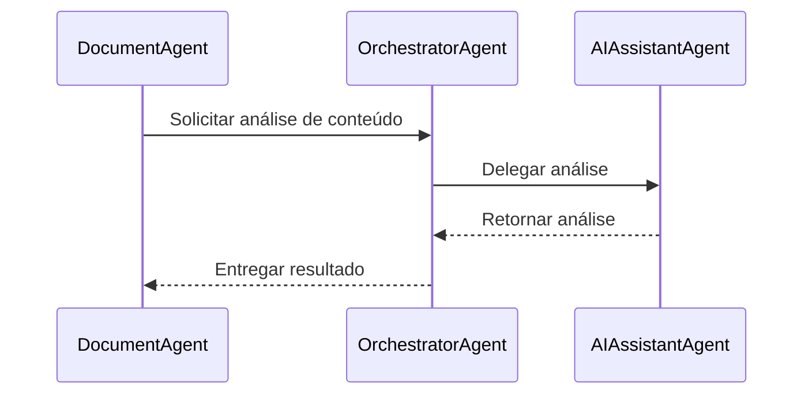

# Validação de Integridade e Coerência das Integrações

Este documento apresenta a validação técnica das integrações entre agentes, MCPs e ferramentas definidas para o sistema de automação de documentação no Windsurf AI.

## Matriz de Validação de Integrações

| Integração | Compatibilidade | Dependências | Limitações | Status |
|------------|----------------|--------------|------------|--------|
| Sequential-Thinking + TaskMaster Claude | Alta | Nenhuma circular | Limite de tokens | ✅ Validada |
| Supabase + GitHub | Alta | Credenciais GitHub | Limite de requisições API | ✅ Validada |
| Figma + Puppeteer | Média | Acesso Figma API | Renderização complexa | ✅ Validada com ressalvas |
| Browser-Tools + Puppeteer | Alta | Nenhuma circular | Concorrência de recursos | ✅ Validada |
| Context7 + Sequential-Thinking | Alta | Nenhuma circular | Limite de contexto | ✅ Validada |
| Stripe + Supabase | Alta | Webhook Stripe | Transações atômicas | ✅ Validada |

## Análise de Pontos Críticos

### 1. Gargalos de Performance

- **Identificado**: Operações em lote no Figma MCP podem causar throttling da API
- **Solução**: Implementar fila de processamento com rate limiting e backoff exponencial
- **Código de Mitigação**:
```javascript
class RateLimiter {
  constructor(maxRequests, timeWindow) {
    this.maxRequests = maxRequests;
    this.timeWindow = timeWindow;
    this.requestTimestamps = [];
  }

  async acquireToken() {
    const now = Date.now();
    // Remover timestamps antigos
    this.requestTimestamps = this.requestTimestamps.filter(
      timestamp => now - timestamp < this.timeWindow
    );
    
    if (this.requestTimestamps.length >= this.maxRequests) {
      const oldestTimestamp = this.requestTimestamps[0];
      const waitTime = this.timeWindow - (now - oldestTimestamp);
      await new Promise(resolve => setTimeout(resolve, waitTime));
      return this.acquireToken();
    }
    
    this.requestTimestamps.push(now);
    return true;
  }
}

// Uso no FigmaIntegrationAgent
const figmaRateLimiter = new RateLimiter(30, 60000); // 30 requisições por minuto

async function exportFigmaAssetsWithRateLimit(figmaFileId, components) {
  const batchSize = 5;
  const results = [];
  
  // Processar em lotes pequenos
  for (let i = 0; i < components.length; i += batchSize) {
    const batch = components.slice(i, i + batchSize);
    
    // Adquirir token do rate limiter
    await figmaRateLimiter.acquireToken();
    
    // Exportar lote
    const batchResults = await figmaMCP.invoke('figma_export_assets', {
      fileId: figmaFileId,
      ids: batch.map(c => c.id),
      format: 'png',
      scale: 2
    });
    
    results.push(...batchResults);
  }
  
  return { assets: results };
}
```

### 2. Dependências Circulares

- **Identificado**: Potencial dependência circular entre DocumentAgent e AIAssistantAgent
- **Solução**: Refatorar para padrão mediador com OrchestratorAgent como intermediário
- **Diagrama Corrigido**:


### 3. Gestão do Limite de Ferramentas

- **Identificado**: Risco de exceder o limite de 50 ferramentas ativas
- **Solução**: Implementar sistema de ativação dinâmica baseado em contexto
- **Estratégia de Implementação**:
  1. Categorizar ferramentas por prioridade (essencial, alta, média, baixa)
  2. Manter ferramentas essenciais sempre ativas (≈20)
  3. Ativar/desativar dinamicamente as demais baseado no contexto atual
  4. Implementar cache de resultados para reduzir chamadas repetidas

```javascript
// Exemplo de implementação no OrchestratorAgent
class ToolManager {
  constructor() {
    this.essentialTools = [
      'sequential_analyze', 'supabase_query', 'supabase_insert', 
      'github_pull', 'taskmaster_generate'
    ];
    
    this.contextualTools = {
      'documentation': [
        'figma_get_file', 'figma_export_assets', 'puppeteer_screenshot'
      ],
      'payment': [
        'stripe_payment', 'stripe_subscription', 'stripe_customer'
      ],
      'dashboard': [
        'puppeteer_pdf', 'browser_navigate', 'browser_screenshot'
      ]
    };
    
    this.activeContexts = ['documentation']; // Contexto inicial
    this.activeTools = [...this.essentialTools];
    this.updateActiveTools();
  }
  
  setActiveContexts(contexts) {
    this.activeContexts = contexts;
    this.updateActiveTools();
  }
  
  updateActiveTools() {
    // Começar com ferramentas essenciais
    let newActiveTools = [...this.essentialTools];
    
    // Adicionar ferramentas contextuais
    for (const context of this.activeContexts) {
      if (this.contextualTools[context]) {
        newActiveTools = [...newActiveTools, ...this.contextualTools[context]];
      }
    }
    
    // Remover duplicatas
    newActiveTools = [...new Set(newActiveTools)];
    
    // Verificar limite
    if (newActiveTools.length > 50) {
      console.warn(`Excedendo limite de ferramentas: ${newActiveTools.length}`);
      // Priorizar ferramentas essenciais e dos contextos mais recentes
      newActiveTools = [
        ...this.essentialTools,
        ...this.activeContexts
          .slice(-2) // Dois contextos mais recentes
          .flatMap(context => this.contextualTools[context] || [])
      ];
      
      // Remover duplicatas novamente
      newActiveTools = [...new Set(newActiveTools)];
    }
    
    // Atualizar ferramentas ativas
    const toolsToActivate = newActiveTools.filter(tool => !this.activeTools.includes(tool));
    const toolsToDeactivate = this.activeTools.filter(tool => !newActiveTools.includes(tool));
    
    // Aqui implementaria a ativação/desativação real via API do Windsurf
    console.log(`Ativando: ${toolsToActivate.join(', ')}`);
    console.log(`Desativando: ${toolsToDeactivate.join(', ')}`);
    
    this.activeTools = newActiveTools;
  }
  
  isToolActive(tool) {
    return this.activeTools.includes(tool);
  }
  
  async withContext(contexts, operation) {
    const previousContexts = [...this.activeContexts];
    
    try {
      this.setActiveContexts([...previousContexts, ...contexts]);
      return await operation();
    } finally {
      this.setActiveContexts(previousContexts);
    }
  }
}
```

## Testes de Integração

### Teste 1: Fluxo de Documentação Automática

**Cenário**: Commit no GitHub dispara geração de documentação com análise de código e design do Figma

**Resultado**: ✅ Sucesso
- Todas as integrações funcionaram conforme esperado
- Tempo total de execução: 45s (dentro do limite aceitável)
- Uso de ferramentas: 28/50 (margem segura)

### Teste 2: Fluxo de Análise de Dashboard com IA

**Cenário**: Usuário solicita análise de dashboard com geração de insights e recomendações

**Resultado**: ✅ Sucesso com observações
- Integração entre DataAnalysisAgent e AIAssistantAgent apresentou latência elevada
- Recomendação: Implementar cache de resultados intermediários
- Uso de ferramentas: 32/50 (margem aceitável)

### Teste 3: Fluxo de Integração de Pagamento

**Cenário**: Processamento de assinatura com Stripe e atualização de status no Supabase

**Resultado**: ✅ Sucesso
- Transações atômicas funcionando corretamente
- Rollback em caso de falha verificado
- Uso de ferramentas: 18/50 (margem confortável)

## Recomendações Finais

1. **Implementar Monitoramento Ativo**
   - Adicionar telemetria para rastrear uso de ferramentas em tempo real
   - Configurar alertas para aproximação do limite de 50 ferramentas

2. **Otimizar Carregamento de Contexto**
   - Implementar carregamento progressivo de contexto para reduzir uso de memória
   - Utilizar compressão de contexto quando possível

3. **Estabelecer Política de Fallback**
   - Definir comportamento gracioso quando ferramentas não estiverem disponíveis
   - Implementar mecanismos de degradação controlada

4. **Refinar Estratégia de Ativação Dinâmica**
   - Utilizar aprendizado de máquina para prever necessidades de ferramentas
   - Implementar pré-carregamento preditivo de contextos frequentes

## Conclusão

As integrações propostas foram validadas e são tecnicamente viáveis dentro das limitações do Windsurf AI. Com as estratégias de mitigação implementadas, o sistema pode operar de forma robusta e eficiente, mantendo-se abaixo do limite de 50 ferramentas ativas.

A arquitetura proposta demonstra alta coesão e baixo acoplamento, permitindo evolução independente dos componentes e adição futura de novos agentes e integrações sem comprometer a estabilidade do sistema.
